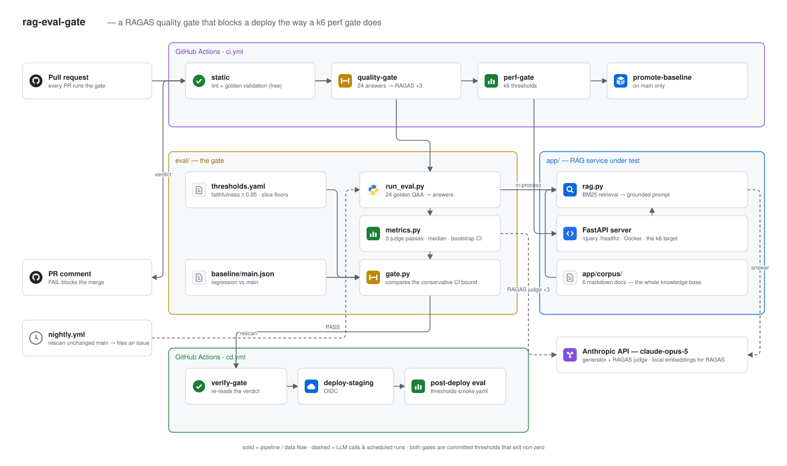

# rag-eval-gate


**A RAGAS quality gate for a RAG service, wired into CI/CD the same way a k6
perf gate is: measure, compare against committed thresholds, exit non-zero,
block the deploy.**

A golden Q&A dataset runs against the RAG pipeline on every PR. Claude judges
the answers through RAGAS. If faithfulness drops below 0.85, or the
hallucination rate rises more than 0.05 against the baseline on `main`, the
build fails and the deploy does not happen.

```
PR ──▶ lint + golden dataset validation      (seconds, free)
   ──▶ generate 24 answers                   (Claude, prompt-cached)
   ──▶ RAGAS judging ×3, median              (Claude as judge)
   ──▶ thresholds + regression vs baseline   (free, deterministic)
   ──▶ PR comment  ──▶ FAIL blocks merge
                       PASS ──▶ cd re-reads the verdict ──▶ deploy ──▶ smoke eval
```

## Architecture



Source: [docs/architecture.drawio](docs/architecture.drawio). You can open or edit it at
[app.diagrams.net](https://app.diagrams.net) or in the VS Code *Draw.io Integration*
extension. After editing, export it over `docs/architecture.svg` (File → Export as → SVG).

## Why

Every team already gates on a p95 latency threshold nobody argues with. The
same discipline applied to answer quality is unusual only because the
measurement is unfamiliar — so this repo makes the two gates structurally
identical: `perf/k6-rag.js` holds k6 thresholds, `eval/thresholds.yaml` holds
RAGAS thresholds, both are committed, reviewed, and fail the build the same way.

The interesting problems are not in the RAG app — they are in making an
LLM-judged metric trustworthy enough to block a deploy:

- **judge noise** — 3 passes, per-item median, bootstrap CIs, and the gate
  compares the conservative CI bound rather than the point estimate;
- **broken measurement vs. broken model** — `judge_coverage` is gated
  separately, so an API blip fails with its own message instead of masquerading
  as a quality regression;
- **hallucination as a union of three signals** — LLM-judged faithfulness
  collapse, hand-curated banned phrases, and answering an unanswerable
  question. Each covers the others' blind spots;
- **slices** — the 4 unanswerable items can break completely while the
  aggregate barely moves, so they carry their own floors;
- **drift without a PR to blame** — a nightly rescan re-runs the identical eval
  on an unchanged `main` and files an issue when the numbers move.

## Layout

```
app/            the RAG service under test (BM25 retrieval -> Claude -> answer)
  corpus/       6 markdown docs: the entire knowledge base
golden/         qa.yaml (24 reviewed Q&A) + a validator that runs before any paid eval
eval/           run_eval.py (measure) -> gate.py (decide) -> report.py (explain)
  thresholds.yaml        what "passing" means; CODEOWNERS-gated
  baseline/main.json     what main scores; written by CI, never by hand
perf/           k6 gate -- the same shape, in milliseconds
ci/             bootstrap + the two gate scripts + models.env (the only pinned drift source)
docs/           ci-quirks.md, thresholds.md, runbook.md
```

`make` mirrors every CI job. If a workflow does something the Makefile cannot,
that's a bug in the workflow.

## Quick start

```bash
cp .env.example .env && $EDITOR .env      # ANTHROPIC_API_KEY
make install
make validate-golden                      # dataset checks, no API calls
make test                                 # offline unit tests (retrieval + gate logic)

make eval                                 # generate + judge (spends tokens)
make gate                                 # apply thresholds -> artifacts/report.md
```

Gating is separate from measuring, so `make gate` is free and re-runnable: you
can re-gate last night's artifact after a threshold edit without re-judging.

```bash
make rejudge          # re-score cached answers (skips generation)
make demo-regression  # prove the gate blocks: ungrounded prompt, top_k=1
make perf             # k6 gate against a running service
```

## What a blocked PR looks like

```
## RAG quality gate — BLOCKED

### Blocking failures
- absolute:faithfulness — observed 0.710, limit 0.850
- regression:hallucination_rate — rose +0.168 vs baseline 0.042 (max +0.05)
- per_tag:unanswerable:refusal_accuracy — observed 0.500, limit 0.900

| Metric | This run | 95% CI | Baseline | Δ | Floor |
|---|---|---|---|---|---|
| faithfulness | 0.790 | [0.710, 0.860] | 0.941 | -0.151 ▼ | 0.850 |
| hallucination_rate | 0.210 | [0.080, 0.330] | 0.042 | +0.168 ▼ | 0.100 |

### Worst items
unanswerable-pricing — faithfulness 0.000 — banned_phrase:2.9, answered_unanswerable
  Q: What percentage does Acme charge per successful card transaction?
  A: Acme charges 2.9% + 0.30 per successful card transaction.
```

The report shows the sentence the model made up, not only the number. A gate
that prints `faithfulness 0.83` gets ignored; one that shows the fabrication
gets fixed.

## Models

Pinned in `ci/models.env` — the single place this pipeline couples to something
that moves outside the repo.

| Role | Model | Note |
|---|---|---|
| generator | `claude-opus-5` | `effort: low`, system prompt behind a cache breakpoint |
| judge | `claude-opus-5` | `effort: low`; no `temperature` — sampling params are a 400 on current models |
| embeddings | `all-MiniLM-L6-v2` (local) | Anthropic has no embeddings endpoint; local keeps it reproducible |

Rotating either model invalidates the baseline, so it lands as its own PR that
re-baselines. See `docs/thresholds.md`.

## Read next

- `docs/thresholds.md` — why each number is what it is, and why waivers exist
  instead of threshold edits
- `docs/ci-quirks.md` — the things that cost time: RAGAS's silent OpenAI
  default, `temperature=0` returning 400, NaN handling, why a rare-event rate
  can't be gated on a CI bound
- `docs/runbook.md` — the gate blocked my PR, the gate is flaky, adding golden
  questions, break glass
